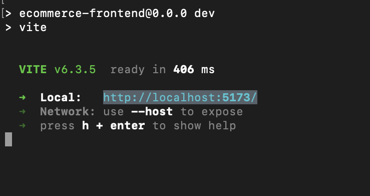

# 🛒 AWS Serverless eCommerce Frontend

This is a simple React frontend built with **Vite** to display products fetched from a **serverless backend** powered by AWS (API Gateway, Lambda, and DynamoDB).

---

## 📦 Features

- Fetches product data from AWS API Gateway
- Dynamically renders product listings
- Styled with minimal layout (no external CSS framework)
- Optimized with Vite for fast builds and HMR

---

## 🖼️ Screenshots

| Product UI                     | Vite Running Locally             |
|-------------------------------|----------------------------------|
|  |  | 

---

## 🔧 Project Structure
